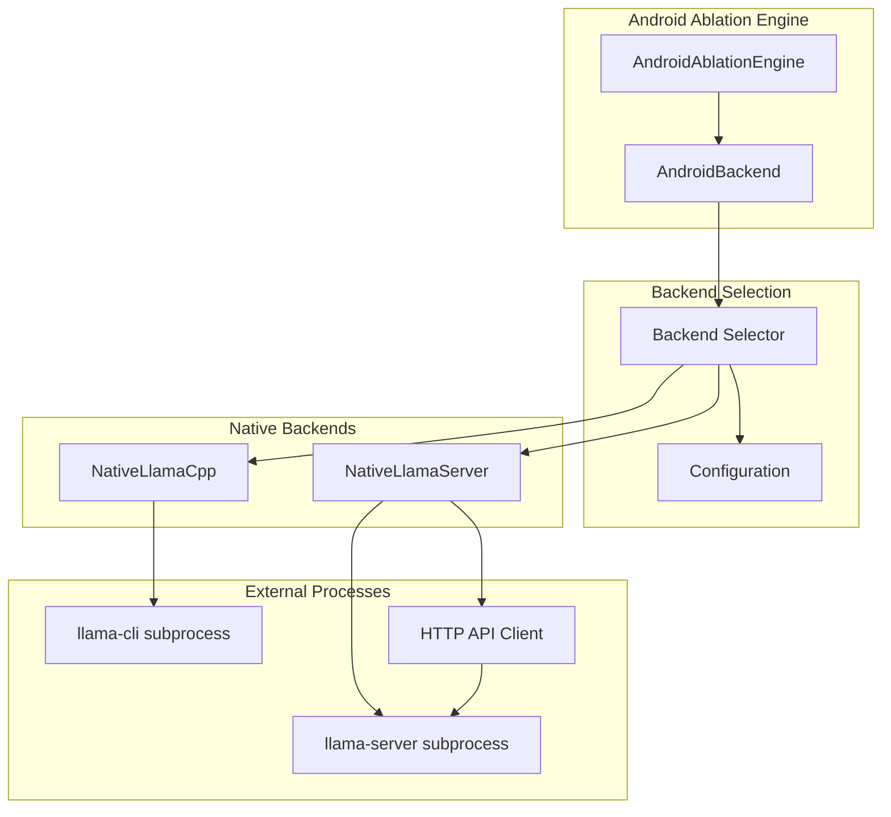

# Design Document: Android llama-server Ablation Support

## Overview

This design implements llama-server integration for the Android ablation engine to enable accurate cache ablation studies. The current AndroidAblationEngine uses llama-cli which cannot disable KV cache, preventing true "no cache" baseline measurements. This implementation adds llama-server support with proper cache control flags (`--cache-ram 0`, `--no-cache-prompt`) to enable rigorous ablation studies.

The solution maintains backward compatibility with existing llama-cli behavior while providing automatic backend selection based on ablation configuration and llama-server availability. When `enable_ablation_studies: true` is configured for Android, the system will automatically use llama-server if available, falling back to llama-cli with appropriate warnings.

Key benefits:
- **True cache ablation**: Ability to completely disable both RAM and disk caching for control runs
- **Per-request cache control**: Fine-grained control over prompt caching without server restarts
- **Backward compatibility**: Existing llama-cli workflows remain unchanged
- **Automatic selection**: Intelligent backend selection based on configuration and availability

## Architecture

The architecture introduces a new `NativeLlamaServer` class that mirrors the interface of the existing `NativeLlamaCpp` class, enabling seamless interchangeability. The AndroidBackend uses a factory pattern to select the appropriate backend based on configuration.



### Backend Selection Logic

The backend selection follows this priority order:

1. **Explicit Configuration**: If `use_llama_server_for_ablation` is set, use that value
2. **Ablation Mode**: If `enable_ablation_studies` is true and platform is Android, prefer llama-server
3. **Availability Check**: Verify llama-server binary exists at expected path
4. **Fallback**: Use llama-cli if llama-server is not available

### Cache Control Strategy

The design implements a dual-layer cache control approach:

1. **Server-level**: Command-line flags control global cache behavior
   - `--cache-ram 0`: Disables RAM-based KV cache
   - `--no-cache-prompt`: Disables disk-based prompt cache

2. **Request-level**: HTTP API parameters control per-request behavior
   - `cache_prompt`: Boolean flag in completion requests

## Components and Interfaces

### NativeLlamaServer Class

The `NativeLlamaServer` class provides the same interface as `NativeLlamaCpp` to ensure drop-in compatibility:

```python
class NativeLlamaServer:
    def __init__(self, 
                 model_path: str,
                 n_ctx: int = 4096,
                 n_threads: int = -1,
                 n_batch: int = 512,
                 cache_mode: str = "both",
                 llama_server_path: str = None,
                 host: str = "127.0.0.1",
                 port: int = 8080):
        """Initialize llama-server subprocess and HTTP client."""
        
    def __call__(self, 
                 prompt: str,
                 max_tokens: int = 128,
                 stream: bool = True,
                 enable_prompt_cache: bool = False) -> Iterator[str]:
        """Generate text completion via HTTP API."""
        
    def create_completion(self, *args, **kwargs):
        """Alias for __call__ method for compatibility."""
        
    def tokenize(self, text: str) -> List[int]:
        """Approximate tokenization (char_count / 4)."""
        
    def close(self):
        """Terminate llama-server subprocess."""
        
    def __enter__(self):
        return self
        
    def __exit__(self, exc_type, exc_val, exc_tb):
        self.close()
```

### Subprocess Management

The subprocess management handles the complete lifecycle of the llama-server process:

**Startup Process:**
1. Build command-line arguments based on cache_mode
2. Start subprocess with `subprocess.Popen`
3. Poll `/health` endpoint with 30-second timeout
4. Store process PID for memory monitoring
5. Start background thread for memory tracking

**Cache Mode Configuration:**
- `"none"`: `--cache-ram 0 --no-cache-prompt`
- `"ram_only"`: `--no-cache-prompt`
- `"disk_only"`: `--cache-ram 0`
- `"both"`: No cache restriction flags

**Health Monitoring:**
- HTTP GET requests to `/health` endpoint
- Exponential backoff retry strategy
- Process status verification via `poll()`

### HTTP API Client

The HTTP client implements streaming completion requests compatible with llama-server's API:

**Request Format:**
```json
{
    "prompt": "string",
    "n_predict": 128,
    "stream": true,
    "cache_prompt": false,
    "temperature": 0.8,
    "top_k": 40,
    "top_p": 0.9
}
```

**Response Handling:**
- Server-Sent Events (SSE) format parsing
- Chunked transfer encoding support
- JSON parsing of individual chunks
- Text extraction and yielding

**Error Handling:**
- Connection errors with diagnostic information
- Timeout errors with configured timeout values
- HTTP status code validation
- JSON parsing error recovery

### Memory Monitoring

Memory monitoring maintains compatibility with existing metrics collection:

**Background Thread:**
- Samples memory usage every 50ms
- Tracks peak memory in `subprocess_peak_memory_kb`
- Updates `subprocess_is_running` flag
- Handles process termination gracefully

**Compatibility Attributes:**
- `last_subprocess_pid`: Process ID for external monitoring
- `subprocess_peak_memory_kb`: Peak memory usage tracking
- `subprocess_is_running`: Process status flag

## Data Models

### Configuration Schema

```python
@dataclass
class AndroidConfig:
    enable_ablation_studies: bool = False
    use_llama_server_for_ablation: Optional[bool] = None
    llama_server_host: str = "127.0.0.1"
    llama_server_port: int = 8080
    llama_server_path: Optional[str] = None
    llama_server_timeout: int = 600
```

### Cache Configuration

```python
class CacheMode(Enum):
    NONE = "none"          # --cache-ram 0 --no-cache-prompt
    RAM_ONLY = "ram_only"  # --no-cache-prompt
    DISK_ONLY = "disk_only" # --cache-ram 0
    BOTH = "both"          # No restrictions
```

### Ablation Scenario Mapping

```python
ABLATION_CACHE_CONFIG = {
    "control": {
        "cache_mode": CacheMode.NONE,
        "enable_prompt_cache": False
    },
    "cold_cache": {
        "cache_mode": CacheMode.BOTH,
        "enable_prompt_cache": True  # First request only
    },
    "warm_cache": {
        "cache_mode": CacheMode.BOTH,
        "enable_prompt_cache": True  # Subsequent requests
    },
    "ram_only": {
        "cache_mode": CacheMode.RAM_ONLY,
        "enable_prompt_cache": False
    },
    "disk_only": {
        "cache_mode": CacheMode.DISK_ONLY,
        "enable_prompt_cache": True
    }
}
```

## Correctness Properties

*A property is a characteristic or behavior that should hold true across all valid executions of a system-essentially, a formal statement about what the system should do. Properties serve as the bridge between human-readable specifications and machine-verifiable correctness guarantees.*

Before writing correctness properties, I need to analyze the acceptance criteria for testability:

### Property 1: Backend Selection Logic

*For any* configuration with enable_ablation_studies, platform, and use_llama_server_for_ablation settings, the AndroidBackend should select the correct backend according to the priority rules: explicit configuration overrides automatic selection, which prefers llama-server for Android ablation studies when available.

**Validates: Requirements 1.1, 1.2, 1.5**

### Property 2: Command-Line Argument Construction

*For any* valid initialization parameters (model_path, n_ctx, n_threads, cache_mode), the NativeLlamaServer should construct command-line arguments that correctly include all parameters and appropriate cache control flags based on the cache_mode.

**Validates: Requirements 2.2, 4.1, 4.2, 4.3, 4.4**

### Property 3: HTTP Request Body Construction

*For any* valid completion parameters (prompt, max_tokens, enable_prompt_cache), the NativeLlamaServer should construct HTTP request bodies that include all required fields with correct values and proper cache_prompt parameter mapping.

**Validates: Requirements 3.2, 5.1, 5.2**

### Property 4: Timeout Calculation

*For any* positive max_tokens value, the NativeLlamaServer should calculate request timeout using the formula (max_tokens * 2 + 60) seconds, ensuring adequate time for completion generation.

**Validates: Requirements 3.7**

### Property 5: Output Format Compatibility

*For any* valid prompt and generation parameters, when both NativeLlamaCpp and NativeLlamaServer are available, they should produce text chunks in the same format to maintain compatibility with existing code.

**Validates: Requirements 3.4**

### Property 6: Fallback Behavior

*For any* configuration where llama-server is preferred but unavailable, the AndroidBackend should fall back to llama-cli and log appropriate warning messages about ablation study limitations.

**Validates: Requirements 1.3**

## Error Handling

The error handling strategy addresses multiple failure modes across subprocess management, HTTP communication, and configuration validation:

### Subprocess Management Errors

**Process Startup Failures:**
- Binary not found: `FileNotFoundError` with path information
- Permission denied: `PermissionError` with diagnostic details
- Process crash during startup: `RuntimeError` with stderr output

**Health Check Failures:**
- Connection refused: Retry with exponential backoff
- Timeout after 30 seconds: `TimeoutError` with diagnostic information
- Invalid health response: `RuntimeError` with response details

### HTTP Communication Errors

**Request Failures:**
- Connection errors: `ConnectionError` with server details
- Timeout errors: `TimeoutError` with configured timeout value
- HTTP status errors: `HTTPError` with status code and response body

**Response Processing Errors:**
- Invalid JSON: Log warning and continue with partial response
- Malformed SSE: Skip invalid chunks and continue streaming
- Connection drops: Raise `ConnectionError` with partial response

### Configuration Validation

**Invalid Parameters:**
- Invalid cache_mode: `ValueError` with valid options
- Invalid port numbers: `ValueError` with valid range
- Missing model path: `FileNotFoundError` with expected location

**Compatibility Issues:**
- Unsupported llama-server version: Warning with version requirements
- Missing required endpoints: `RuntimeError` with endpoint list

### Recovery Strategies

**Graceful Degradation:**
- Fall back to llama-cli when llama-server fails
- Continue with partial responses when possible
- Use default values for optional parameters

**Resource Cleanup:**
- Terminate subprocess on exit
- Close HTTP connections properly
- Clean up temporary files

## Testing Strategy

The testing strategy employs a dual approach combining unit tests for specific behaviors and property-based tests for comprehensive input coverage:

### Unit Testing Approach

**Subprocess Management:**
- Mock `subprocess.Popen` to test process creation
- Simulate process crashes and verify error handling
- Test health check polling with various response scenarios
- Verify cleanup behavior on object destruction

**HTTP Client:**
- Mock `requests` library to test API interactions
- Simulate streaming responses with chunked encoding
- Test error conditions (timeouts, connection failures)
- Verify request body construction for various parameters

**Backend Selection:**
- Test configuration parsing and validation
- Verify binary availability detection
- Test fallback logic with missing binaries
- Verify logging of warnings and errors

### Property-Based Testing Configuration

Property-based tests use **Hypothesis** library with minimum 100 iterations per test:

**Test Configuration:**
```python
from hypothesis import given, strategies as st
from hypothesis import settings

@settings(max_examples=100, deadline=None)
@given(
    enable_ablation=st.booleans(),
    platform=st.sampled_from(["android", "linux", "macos"]),
    use_server=st.one_of(st.none(), st.booleans())
)
def test_backend_selection_property(enable_ablation, platform, use_server):
    """Feature: android-llama-server-ablation, Property 1: Backend Selection Logic"""
    # Test implementation
```

**Generator Strategies:**
- Configuration objects with valid/invalid combinations
- Model paths with existing/missing files
- Network parameters with valid/invalid ranges
- Cache modes with all enum values
- Prompt strings with various lengths and encodings

### Integration Testing

**End-to-End Scenarios:**
- Complete ablation study execution with mocked llama-server
- Performance comparison between backends (mocked measurements)
- Memory monitoring accuracy verification
- Configuration file parsing and application

**Compatibility Testing:**
- Interface compatibility between NativeLlamaCpp and NativeLlamaServer
- Metrics collection compatibility
- AndroidAblationEngine integration
- Existing test suite regression verification

### Mock Strategy

**External Dependencies:**
- `subprocess.Popen`: Mock process creation and management
- `requests`: Mock HTTP client interactions
- File system operations: Mock binary availability checks
- Time operations: Mock for timeout testing

**Test Isolation:**
- Each test uses fresh mock instances
- No shared state between test cases
- Deterministic behavior through controlled mocks
- Cleanup verification after each test

The testing approach ensures comprehensive coverage while maintaining fast execution times and reliable results in CI environments.