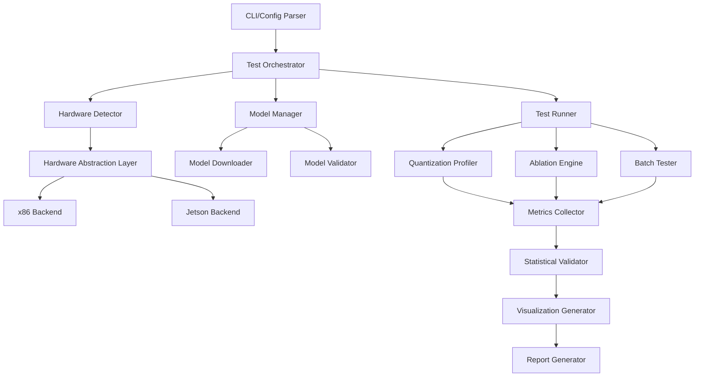

# Design Document: Comprehensive LLM Benchmark Framework

## Overview

The Comprehensive LLM Benchmark Framework is a cross-platform performance evaluation system for large language model inference. The system extends an existing Python benchmark script to provide systematic performance measurement across multiple hardware platforms (Linux x86 and NVIDIA Jetson Xavier NX), quantization levels, and optimization strategies.

### Design Goals

1. **Cross-Platform Support**: Seamless operation on both x86 Linux systems and ARM-based Jetson Xavier NX with GPU acceleration
2. **Comprehensive Metrics**: Detailed measurement of prefill/decode phases, memory usage, thermal characteristics, and power consumption
3. **Statistical Rigor**: Multiple runs with statistical validation to ensure result reliability
4. **Reproducibility**: Complete environment capture and deterministic test execution
5. **Extensibility**: Modular architecture supporting new hardware platforms, metrics, and optimization techniques

### Key Capabilities

- Automatic hardware detection and platform-specific optimization
- Multi-level quantization profiling (Q8_0, Q4_0, Q4_K_M, Q2_K)
- GPU acceleration support with automatic fallback
- KV cache ablation studies (RAM vs disk, cold vs warm)
- Prompt caching effectiveness measurement
- Batch processing and throughput optimization
- Thermal and power monitoring on supported platforms
- Statistical validation with confidence intervals
- Automated visualization generation

## Architecture

### System Architecture

The framework follows a modular pipeline architecture with clear separation of concerns:



### Component Responsibilities

**Test Orchestrator**: Top-level coordinator managing test execution flow, configuration, warmup runs, garbage collection, and thermal stabilization delays.

**Hardware Detector**: Platform identification, capability detection (CPU features, GPU availability, memory), and sensor discovery (thermal, power).

**Hardware Abstraction Layer (HAL)**: Unified interface for platform-specific operations, isolating x86 and Jetson-specific code paths.

**Model Manager**: Model acquisition from Hugging Face Hub, local caching, integrity verification, and GGUF format validation.

**Quantization Profiler**: Systematic testing across quantization levels with identical prompts, measuring load time, memory usage, and inference performance.

**Ablation Engine**: Controlled experiments isolating specific optimization effects (KV cache strategies, prompt caching, batch sizes).

**Metrics Collector**: Real-time measurement of inference metrics (TTFT, throughput, memory, GPU utilization, thermal, power).

**Statistical Validator**: Multi-run aggregation, confidence interval calculation, significance testing, and outlier detection.

**Visualization Generator**: Chart generation (bar, line, scatter, heatmap) with error bars and interactive HTML reports.

**Report Generator**: Multi-format output (JSON, CSV, Markdown, HTML) with complete environment documentation.

## Components and Interfaces

### Hardware Detector

**Purpose**: Identify execution platform and available hardware capabilities.

**Interface**:
```python
class HardwareInfo:
    os_type: str  # "linux_x86" | "jetson_xavier_nx"
    cpu_model: str
    cpu_cores: int
    cpu_features: List[str]  # ["avx2", "avx512", ...]
    total_ram_gb: float
    available_ram_gb: float
    has_gpu: bool
    gpu_model: Optional[str]
    gpu_memory_gb: Optional[float]
    gpu_compute_capability: Optional[str]
    has_thermal_sensors: bool
    has_power_sensors: bool

class HardwareDetector:
    def detect() -> HardwareInfo:
        """Detect hardware platform and capabilities."""
        
    def get_optimal_config(hw_info: HardwareInfo) -> Dict[str, Any]:
        """Return optimal configuration for detected hardware."""
```

**Implementation Strategy**:
- Use `platform` module for OS/CPU detection
- Parse `/proc/cpuinfo` for CPU features on Linux
- Use `psutil` for memory information
- Detect Jetson via `/etc/nv_tegra_release` or device tree
- Use `pynvml` for NVIDIA GPU detection and capabilities
- Probe `/sys/class/thermal` for thermal sensors
- Probe `/sys/class/hwmon` or Jetson-specific power rails

### Hardware Abstraction Layer (HAL)

**Purpose**: Provide unified interface for platform-specific operations.

**Interface**:
```python
class HardwareBackend(ABC):
    @abstractmethod
    def get_llama_config(self) -> Dict[str, Any]:
        """Return llama-cpp-python configuration for this platform."""
    
    @abstractmethod
    def get_metrics_collector(self) -> MetricsCollector:
        """Return platform-specific metrics collector."""
    
    @abstractmethod
    def optimize_for_inference(self) -> None:
        """Apply platform-specific optimizations."""

class X86Backend(HardwareBackend):
    def get_llama_config(self) -> Dict[str, Any]:
        return {
            "n_gpu_layers": 0,  # CPU-only
            "use_mlock": True,
            "n_threads": self.hw_info.cpu_cores
        }

class JetsonBackend(HardwareBackend):
    def get_llama_config(self) -> Dict[str, Any]:
        gpu_layers = self._calculate_gpu_layers()
        return {
            "n_gpu_layers": gpu_layers,
            "use_mlock": False,  # Limited RAM on Jetson
            "n_threads": 4  # Leave cores for system
        }
    
    def _calculate_gpu_layers(self) -> int:
        """Calculate optimal GPU layer count based on available GPU memory."""
        # Heuristic: ~100MB per layer for 8B model
        available_mb = self.hw_info.gpu_memory_gb * 1024 * 0.8  # 80% utilization
        return int(available_mb / 100)
```

**Design Rationale**: The HAL isolates platform differences, making it easy to add new platforms without modifying core logic. Each backend encapsulates platform-specific knowledge (optimal thread counts, GPU layer calculations, memory management strategies).

### Model Manager

**Purpose**: Handle model acquisition, caching, and validation.

**Interface**:
```python
class ModelInfo:
    quantization: str
    filename: str
    local_path: str
    sha256: str
    size_mb: float

class ModelManager:
    def __init__(self, cache_dir: str, hf_token: Optional[str]):
        self.cache_dir = cache_dir
        self.hf_token = hf_token
    
    def get_model(self, repo_id: str, filename: str) -> ModelInfo:
        """Get model from cache or download from Hugging Face."""
    
    def download_with_retry(self, repo_id: str, filename: str, 
                           max_retries: int = 3) -> str:
        """Download model with exponential backoff retry."""
    
    def verify_integrity(self, path: str, expected_sha256: Optional[str]) -> bool:
        """Verify model file integrity."""
    
    def validate_gguf(self, path: str) -> bool:
        """Validate GGUF format correctness."""
```

**Implementation Strategy**:
- Use `huggingface_hub.hf_hub_download` for downloads with progress callbacks
- Implement exponential backoff: 1s, 2s, 4s delays between retries
- Compute SHA256 using streaming to handle large files
- Validate GGUF by checking magic bytes and header structure
- Cache models in `~/.cache/llm_benchmark/models` by default

### Quantization Profiler

**Purpose**: Systematically measure performance across quantization levels.

**Interface**:
```python
class QuantizationResult:
    quantization: str
    load_time_s: float
    peak_ram_mb: float
    ram_increase_mb: float
    ttft_ms: float
    prefill_tps: float
    decode_tps: float
    prompt_tokens: int
    output_tokens: int
    gpu_memory_mb: Optional[float]
    gpu_utilization_pct: Optional[float]

class QuantizationProfiler:
    def __init__(self, backend: HardwareBackend, metrics_collector: MetricsCollector):
        self.backend = backend
        self.metrics = metrics_collector
    
    def profile_quantization(self, model_path: str, quant: str, 
                            prompt: str, max_tokens: int) -> QuantizationResult:
        """Profile single quantization level."""
    
    def profile_all(self, models: Dict[str, str], prompt: str, 
                   max_tokens: int) -> List[QuantizationResult]:
        """Profile all quantization levels with identical prompt."""
```

**Implementation Strategy**:
- Measure baseline memory before model load using `psutil.Process().memory_info()`
- Time model loading with `time.perf_counter()`
- Perform warmup inference (5 tokens) before measurement
- Use streaming inference to capture TTFT accurately
- Calculate prefill throughput as `prompt_tokens / ttft_s`
- Calculate decode throughput as `(output_tokens - 1) / decode_duration`
- Enforce garbage collection between quantization tests

### Ablation Engine

**Purpose**: Conduct controlled experiments isolating optimization effects.

**Interface**:
```python
class AblationResult:
    scenario: str
    configuration: Dict[str, Any]
    metrics: Dict[str, float]
    improvement_over_baseline: Optional[float]

class AblationEngine:
    def __init__(self, backend: HardwareBackend):
        self.backend = backend
    
    def test_kv_cache_strategies(self, model_path: str) -> List[AblationResult]:
        """Test RAM vs disk KV cache with cold/warm runs."""
    
    def test_prompt_caching(self, model_path: str, 
                           prefix_lengths: List[int]) -> List[AblationResult]:
        """Test prompt caching with varying shared prefix lengths."""
    
    def test_batch_sizes(self, model_path: str, 
                        batch_sizes: List[int]) -> List[AblationResult]:
        """Test throughput across different batch sizes."""
    
    def _ensure_process_isolation(self) -> None:
        """Force garbage collection and create fresh model instance."""
```

**KV Cache Testing Strategy**:
1. **Control Run**: Fresh model instance, no cache, measure TTFT
2. **Cold Run (RAM)**: Fresh model with RAM cache, empty cache, measure TTFT
3. **Warm Run (RAM)**: Same model instance, populated cache, measure TTFT with shared prefix
4. **Cold Run (Disk)**: Fresh model with disk cache, empty cache, measure TTFT
5. **Warm Run (Disk)**: Same model instance, populated cache, measure TTFT with shared prefix

**Prompt Caching Strategy**:
- Generate prompts with shared prefixes of 100, 500, 1000 tokens
- Measure cache hit rate (tokens reused / total tokens)
- Measure latency reduction (cold TTFT - warm TTFT)
- Measure cache memory overhead
- Test across different quantization levels

**Batch Size Strategy**:
- Test batch sizes: 1, 2, 4, 8, 16
- Measure aggregate throughput (total tokens / total time)
- Measure per-prompt latency distribution
- Measure memory scaling
- Identify optimal batch size (max throughput without OOM)

### Metrics Collector

**Purpose**: Real-time measurement of inference metrics.

**Interface**:
```python
class InferenceMetrics:
    ttft_ms: float
    prefill_tps: float
    decode_tps: float
    total_time_s: float
    prompt_tokens: int
    output_tokens: int
    peak_memory_mb: float
    per_token_latency_ms: List[float]
    gpu_memory_mb: Optional[float]
    gpu_utilization_pct: Optional[float]
    cpu_temp_c: Optional[float]
    gpu_temp_c: Optional[float]
    power_watts: Optional[float]

class MetricsCollector:
    def __init__(self, hw_info: HardwareInfo):
        self.hw_info = hw_info
        self.thermal_monitor = ThermalMonitor() if hw_info.has_thermal_sensors else None
        self.power_monitor = PowerMonitor() if hw_info.has_power_sensors else None
    
    def start_monitoring(self) -> None:
        """Start background monitoring threads for thermal/power."""
    
    def stop_monitoring(self) -> None:
        """Stop background monitoring and aggregate results."""
    
    def collect_inference_metrics(self, llm: Llama, prompt: str, 
                                  max_tokens: int) -> InferenceMetrics:
        """Collect comprehensive metrics during inference."""
```

**Implementation Strategy**:
- Use `time.perf_counter()` for high-resolution timing
- Capture TTFT by measuring time to first chunk in streaming inference
- Track per-token latency by timestamping each chunk
- Use `psutil.Process().memory_info()` for memory tracking
- Use `pynvml` for GPU metrics (memory, utilization)
- Run thermal/power monitoring in background thread at 1 Hz
- Aggregate thermal/power as (min, avg, max) over inference duration

### Statistical Validator

**Purpose**: Perform statistical analysis on multi-run results.

**Interface**:
```python
class StatisticalSummary:
    metric_name: str
    mean: float
    std_dev: float
    confidence_interval_95: Tuple[float, float]
    outliers: List[float]

class ComparisonResult:
    metric_name: str
    config_a_mean: float
    config_b_mean: float
    difference: float
    p_value: float
    is_significant: bool  # p < 0.05

class StatisticalValidator:
    def summarize_runs(self, runs: List[Dict[str, float]]) -> List[StatisticalSummary]:
        """Calculate mean, std dev, confidence intervals for each metric."""
    
    def compare_configurations(self, runs_a: List[Dict[str, float]], 
                              runs_b: List[Dict[str, float]]) -> List[ComparisonResult]:
        """Perform paired t-tests comparing two configurations."""
    
    def detect_outliers(self, values: List[float]) -> List[float]:
        """Detect outliers using IQR method."""
```

**Implementation Strategy**:
- Use `numpy` for mean/std calculations
- Calculate 95% CI as `mean ± 1.96 * (std / sqrt(n))`
- Use `scipy.stats.ttest_rel` for paired t-tests
- Detect outliers as values outside `[Q1 - 1.5*IQR, Q3 + 1.5*IQR]`
- Require minimum 3 runs for statistical validity

### Visualization Generator

**Purpose**: Generate charts and graphs from benchmark results.

**Interface**:
```python
class VisualizationGenerator:
    def __init__(self, output_dir: str, dpi: int = 300):
        self.output_dir = output_dir
        self.dpi = dpi
    
    def plot_quantization_comparison(self, results: List[QuantizationResult]) -> str:
        """Bar chart comparing metrics across quantization levels."""
    
    def plot_throughput_over_time(self, metrics: InferenceMetrics) -> str:
        """Line plot showing token generation rate over time."""
    
    def plot_memory_vs_speed_tradeoff(self, results: List[QuantizationResult]) -> str:
        """Scatter plot showing memory-speed tradeoff."""
    
    def plot_ablation_comparison(self, results: List[AblationResult]) -> str:
        """Before/after comparison for ablation studies."""
    
    def plot_heatmap(self, results: pd.DataFrame, 
                    x_col: str, y_col: str, value_col: str) -> str:
        """Heatmap showing performance across two dimensions."""
    
    def generate_html_report(self, all_results: Dict[str, Any]) -> str:
        """Generate interactive HTML report with all visualizations."""
```

**Implementation Strategy**:
- Use `matplotlib` for chart generation
- Use `seaborn` for enhanced styling and heatmaps
- Include error bars on all charts using confidence intervals
- Save plots as PNG at 300 DPI minimum
- Generate HTML report using `jinja2` template with embedded plots
- Add interactive tooltips using `mpld3` or `plotly`

### Test Orchestrator

**Purpose**: Manage automated test execution and reproducibility.

**Interface**:
```python
class TestConfig:
    models: Dict[str, str]  # quant -> filename
    repo_id: str
    prompts: List[str]
    max_tokens: int
    iterations: int
    warmup_runs: int
    sleep_between_tests_s: int
    output_dir: str
    enable_ablation: bool
    enable_batch_testing: bool

class TestOrchestrator:
    def __init__(self, config: TestConfig, backend: HardwareBackend):
        self.config = config
        self.backend = backend
    
    def run_all_tests(self) -> Dict[str, Any]:
        """Execute complete test suite."""
    
    def run_quantization_tests(self) -> List[QuantizationResult]:
        """Run quantization profiling tests."""
    
    def run_ablation_tests(self) -> List[AblationResult]:
        """Run ablation studies."""
    
    def run_batch_tests(self) -> List[AblationResult]:
        """Run batch processing tests."""
    
    def _warmup(self, llm: Llama) -> None:
        """Perform warmup runs to stabilize system state."""
    
    def _thermal_stabilization_delay(self) -> None:
        """Wait for thermal stabilization between tests."""
    
    def _save_checkpoint(self, results: Dict[str, Any]) -> None:
        """Save intermediate results to prevent data loss."""
```

**Implementation Strategy**:
- Load configuration from JSON/YAML or command-line args
- Perform 2 warmup runs before measurement runs
- Enforce `gc.collect()` between test cases
- Implement configurable sleep delays (default 5s) for thermal stabilization
- Catch exceptions per test case, log error, continue with remaining tests
- Save intermediate results after each test case to `{output_dir}/checkpoint.json`
- Generate final summary report with pass/fail status

## Data Models

### Configuration Schema

```python
@dataclass
class BenchmarkConfig:
    # Model Configuration
    repo_id: str
    models: Dict[str, str]  # quantization -> filename
    model_cache_dir: str = "./models"
    
    # Test Parameters
    context_size: int = 2048
    batch_size: int = 512
    max_tokens: int = 100
    iterations: int = 3
    warmup_runs: int = 2
    
    # Test Selection
    enable_quantization_profiling: bool = True
    enable_ablation_studies: bool = True
    enable_batch_testing: bool = True
    enable_thermal_monitoring: bool = True
    
    # Ablation Configuration
    kv_cache_types: List[str] = field(default_factory=lambda: ["ram", "disk"])
    prompt_cache_prefix_lengths: List[int] = field(default_factory=lambda: [100, 500, 1000])
    batch_sizes: List[int] = field(default_factory=lambda: [1, 2, 4, 8, 16])
    
    # Orchestration
    sleep_between_tests_s: int = 5
    thermal_stabilization_threshold_c: float = 70.0
    inference_timeout_s: int = 300
    
    # Output
    output_dir: str = "./benchmark_results"
    save_formats: List[str] = field(default_factory=lambda: ["json", "csv", "markdown", "html"])
    visualization_dpi: int = 300
    
    # Authentication
    hf_token: Optional[str] = None
```

### Results Schema

```python
@dataclass
class BenchmarkRun:
    # Metadata
    run_id: str
    timestamp: str
    duration_s: float
    
    # Environment
    hardware_info: HardwareInfo
    software_versions: Dict[str, str]  # python, llama-cpp-python, cuda, etc.
    config: BenchmarkConfig
    model_checksums: Dict[str, str]  # filename -> sha256
    
    # Results
    quantization_results: List[QuantizationResult]
    ablation_results: List[AblationResult]
    batch_results: List[AblationResult]
    
    # Statistical Analysis
    statistical_summaries: List[StatisticalSummary]
    comparisons: List[ComparisonResult]
    
    # Visualizations
    visualization_paths: List[str]
    html_report_path: str
```

**Storage Format**:
- Primary format: JSON for machine readability
- Secondary formats: CSV for spreadsheet import, Markdown for human readability
- HTML report with embedded visualizations for presentation

### File Structure

```
benchmark_results/
├── run_20240115_143022/
│   ├── config.json                    # Test configuration
│   ├── hardware_info.json             # Hardware detection results
│   ├── results.json                   # Complete results (primary)
│   ├── results.csv                    # Tabular results
│   ├── results.md                     # Human-readable report
│   ├── report.html                    # Interactive HTML report
│   ├── visualizations/
│   │   ├── quantization_comparison.png
│   │   ├── memory_vs_speed.png
│   │   ├── ablation_kv_cache.png
│   │   ├── ablation_prompt_cache.png
│   │   ├── batch_throughput.png
│   │   └── thermal_profile.png
│   ├── logs/
│   │   ├── benchmark.log              # Detailed execution log
│   │   └── errors.log                 # Error messages
│   └── checkpoints/
│       ├── checkpoint_001.json        # After quantization tests
│       ├── checkpoint_002.json        # After ablation tests
│       └── checkpoint_003.json        # After batch tests
```

## Correctness Properties

*A property is a characteristic or behavior that should hold true across all valid executions of a system—essentially, a formal statement about what the system should do. Properties serve as the bridge between human-readable specifications and machine-verifiable correctness guarantees.*

Before defining properties, I need to assess whether property-based testing is appropriate for this feature.

**PBT Applicability Assessment**:

This feature is a **benchmarking and measurement system** that:
- Interacts heavily with external systems (GPU drivers, file I/O, network downloads)
- Measures non-deterministic real-world performance (timing, memory, thermal)
- Orchestrates complex workflows with side effects
- Validates infrastructure configuration

**Conclusion**: Property-based testing is **NOT appropriate** for the majority of this system because:
1. Core functionality involves side effects (downloading files, running inference, measuring hardware)
2. Metrics are non-deterministic (timing varies, thermal conditions change)
3. Testing requires real hardware and models (cannot be purely generative)
4. Most acceptance criteria test integration with external systems (llama-cpp-python, CUDA, hardware sensors)

However, there are **limited pure functions** suitable for PBT:
- Configuration validation and parsing
- Statistical calculations (mean, std dev, confidence intervals, outlier detection)
- Data format conversions (results to CSV/JSON/Markdown)
- Checksum calculations

**Testing Strategy**: This feature will primarily use:
- **Integration tests** with real models and hardware
- **Mock-based unit tests** for component isolation
- **Example-based tests** for specific scenarios
- **Limited property-based tests** for pure statistical and data transformation functions

Given this assessment, I will **skip the Correctness Properties section** as PBT is not the primary testing approach for this feature.


## Error Handling

### Error Categories and Strategies

#### 1. Model Acquisition Errors

**Scenarios**:
- Network failures during download
- Authentication failures (invalid HF token)
- Disk space exhaustion
- Corrupted downloads

**Handling Strategy**:
```python
class ModelAcquisitionError(Exception):
    pass

def download_with_retry(repo_id: str, filename: str, max_retries: int = 3) -> str:
    for attempt in range(max_retries):
        try:
            path = hf_hub_download(repo_id, filename, token=self.hf_token)
            if not self.verify_integrity(path):
                raise ModelAcquisitionError("Checksum verification failed")
            return path
        except (RequestException, HTTPError) as e:
            if attempt < max_retries - 1:
                delay = 2 ** attempt  # Exponential backoff: 1s, 2s, 4s
                logger.warning(f"Download failed (attempt {attempt+1}/{max_retries}): {e}")
                time.sleep(delay)
            else:
                logger.error(f"Download failed after {max_retries} attempts")
                raise ModelAcquisitionError(f"Failed to download {filename}") from e
```

**Recovery Actions**:
- Retry with exponential backoff (1s, 2s, 4s)
- Skip model and continue with available models
- Log detailed error with diagnostic information
- Suggest manual download if all retries fail

#### 2. Model Loading Errors

**Scenarios**:
- Insufficient RAM for model
- Corrupted GGUF file
- Incompatible quantization format
- Missing CUDA libraries (Jetson)

**Handling Strategy**:
```python
def load_model_safe(model_path: str, config: Dict[str, Any]) -> Optional[Llama]:
    try:
        # Validate GGUF format before loading
        if not validate_gguf(model_path):
            raise ValueError(f"Invalid GGUF format: {model_path}")
        
        # Check available memory
        required_mb = estimate_model_memory(model_path)
        available_mb = psutil.virtual_memory().available / (1024 * 1024)
        if required_mb > available_mb * 0.8:  # Leave 20% headroom
            raise MemoryError(f"Insufficient RAM: need {required_mb}MB, have {available_mb}MB")
        
        llm = Llama(model_path=model_path, **config)
        return llm
        
    except MemoryError as e:
        logger.error(f"Memory error loading {model_path}: {e}")
        logger.info("Suggestion: Reduce context_size or use smaller quantization")
        return None
        
    except Exception as e:
        logger.error(f"Failed to load {model_path}: {e}")
        logger.debug(f"Config: {config}")
        return None
```

**Recovery Actions**:
- Skip model and continue with remaining models
- Suggest reducing context size or batch size
- Suggest using smaller quantization level
- Mark test case as failed in summary report

#### 3. GPU Memory Exhaustion

**Scenarios**:
- Too many GPU layers for available VRAM
- Memory fragmentation
- Concurrent GPU processes

**Handling Strategy**:
```python
def load_model_with_gpu_fallback(model_path: str, initial_gpu_layers: int) -> Llama:
    gpu_layers = initial_gpu_layers
    
    while gpu_layers >= 0:
        try:
            config = {
                "model_path": model_path,
                "n_gpu_layers": gpu_layers,
                "n_ctx": self.config.context_size
            }
            llm = Llama(**config)
            logger.info(f"Successfully loaded with {gpu_layers} GPU layers")
            return llm
            
        except RuntimeError as e:
            if "CUDA out of memory" in str(e) or "out of memory" in str(e).lower():
                gpu_layers = max(0, gpu_layers - 10)  # Reduce by 10 layers
                logger.warning(f"GPU OOM, retrying with {gpu_layers} layers")
                gc.collect()  # Force cleanup
            else:
                raise
    
    # Final fallback: CPU-only
    logger.warning("GPU memory exhausted, falling back to CPU-only")
    return Llama(model_path=model_path, n_gpu_layers=0, n_ctx=self.config.context_size)
```

**Recovery Actions**:
- Reduce GPU layer count by 10 and retry
- Fall back to CPU-only if GPU completely exhausted
- Log GPU memory usage for diagnostics
- Continue benchmark with reduced GPU utilization

#### 4. Inference Timeout

**Scenarios**:
- Model hangs during inference
- Extremely slow inference on underpowered hardware
- Deadlock in llama-cpp-python

**Handling Strategy**:
```python
import signal
from contextlib import contextmanager

class TimeoutError(Exception):
    pass

@contextmanager
def timeout(seconds: int):
    def timeout_handler(signum, frame):
        raise TimeoutError(f"Operation timed out after {seconds}s")
    
    original_handler = signal.signal(signal.SIGALRM, timeout_handler)
    signal.alarm(seconds)
    try:
        yield
    finally:
        signal.alarm(0)
        signal.signal(signal.SIGALRM, original_handler)

def run_inference_safe(llm: Llama, prompt: str, max_tokens: int, 
                       timeout_s: int = 300) -> Optional[InferenceMetrics]:
    try:
        with timeout(timeout_s):
            return self.metrics_collector.collect_inference_metrics(llm, prompt, max_tokens)
    except TimeoutError:
        logger.error(f"Inference timed out after {timeout_s}s")
        logger.info("Suggestion: Reduce max_tokens or context_size")
        return None
```

**Recovery Actions**:
- Terminate inference after timeout (default 300s)
- Mark test case as failed with timeout flag
- Log timeout for diagnostics
- Continue with remaining test cases

#### 5. Thermal Throttling

**Scenarios**:
- CPU/GPU temperature exceeds safe limits
- Performance degradation due to thermal throttling
- System instability

**Handling Strategy**:
```python
def check_thermal_state(self) -> Tuple[bool, float]:
    """Check if system is thermally throttled."""
    if not self.hw_info.has_thermal_sensors:
        return False, 0.0
    
    temps = []
    if self.thermal_monitor.cpu_temp:
        temps.append(self.thermal_monitor.cpu_temp)
    if self.thermal_monitor.gpu_temp:
        temps.append(self.thermal_monitor.gpu_temp)
    
    max_temp = max(temps) if temps else 0.0
    is_throttled = max_temp > self.config.thermal_stabilization_threshold_c
    
    return is_throttled, max_temp

def run_test_with_thermal_protection(self, test_fn: Callable) -> Any:
    is_throttled, temp = self.check_thermal_state()
    
    if is_throttled:
        logger.warning(f"System temperature high ({temp}°C), waiting for cooldown...")
        while is_throttled:
            time.sleep(10)
            is_throttled, temp = self.check_thermal_state()
        logger.info(f"Temperature stabilized at {temp}°C")
    
    result = test_fn()
    
    # Check if throttling occurred during test
    if self.thermal_monitor.detected_throttling:
        logger.warning("Thermal throttling detected during test")
        result.metadata["thermal_throttled"] = True
    
    return result
```

**Recovery Actions**:
- Wait for temperature to drop below threshold before starting test
- Flag results as thermally throttled if detected during test
- Increase sleep delays between tests
- Suggest improving cooling or reducing workload

#### 6. Missing Dependencies

**Scenarios**:
- llama-cpp-python not installed
- CUDA libraries missing on Jetson
- Visualization libraries missing

**Handling Strategy**:
```python
def validate_dependencies() -> List[str]:
    """Validate required dependencies are installed."""
    missing = []
    
    try:
        import llama_cpp
    except ImportError:
        missing.append("llama-cpp-python")
    
    try:
        import pandas
    except ImportError:
        missing.append("pandas")
    
    try:
        import matplotlib
    except ImportError:
        missing.append("matplotlib")
    
    # Check CUDA on Jetson
    if is_jetson():
        try:
            import pynvml
            pynvml.nvmlInit()
        except:
            missing.append("pynvml (for GPU monitoring)")
    
    return missing

def main():
    missing_deps = validate_dependencies()
    if missing_deps:
        logger.error("Missing required dependencies:")
        for dep in missing_deps:
            logger.error(f"  - {dep}")
        logger.info("Install with: pip install -r requirements.txt")
        sys.exit(1)
```

**Recovery Actions**:
- Check dependencies before starting benchmark
- Report missing packages with installation instructions
- Exit gracefully with error code 1

### Error Logging and Diagnostics

**Logging Strategy**:
```python
import logging

def setup_logging(output_dir: str) -> None:
    """Configure logging with file and console handlers."""
    log_dir = os.path.join(output_dir, "logs")
    os.makedirs(log_dir, exist_ok=True)
    
    # Main log: INFO and above
    main_handler = logging.FileHandler(os.path.join(log_dir, "benchmark.log"))
    main_handler.setLevel(logging.INFO)
    main_handler.setFormatter(logging.Formatter(
        '%(asctime)s - %(name)s - %(levelname)s - %(message)s'
    ))
    
    # Error log: ERROR and above
    error_handler = logging.FileHandler(os.path.join(log_dir, "errors.log"))
    error_handler.setLevel(logging.ERROR)
    error_handler.setFormatter(logging.Formatter(
        '%(asctime)s - %(name)s - %(levelname)s - %(message)s\n%(exc_info)s'
    ))
    
    # Console: WARNING and above
    console_handler = logging.StreamHandler()
    console_handler.setLevel(logging.WARNING)
    console_handler.setFormatter(logging.Formatter('%(levelname)s: %(message)s'))
    
    root_logger = logging.getLogger()
    root_logger.setLevel(logging.DEBUG)
    root_logger.addHandler(main_handler)
    root_logger.addHandler(error_handler)
    root_logger.addHandler(console_handler)
```

**Diagnostic Information**:
- Full stack traces in error log
- Hardware state at time of error (memory, temperature, GPU utilization)
- Configuration parameters for failed test
- Model checksums and paths
- Software versions

### Graceful Degradation

**Principle**: Continue with reduced functionality rather than complete failure.

**Examples**:
1. **Missing GPU**: Fall back to CPU-only inference
2. **Missing thermal sensors**: Continue without thermal monitoring
3. **Missing visualization libraries**: Skip visualization generation, save raw data
4. **Single model failure**: Continue with remaining models
5. **Ablation failure**: Continue with quantization profiling

**Implementation**:
```python
def run_all_tests(self) -> BenchmarkRun:
    results = BenchmarkRun()
    
    # Quantization profiling (core functionality)
    try:
        results.quantization_results = self.run_quantization_tests()
    except Exception as e:
        logger.error(f"Quantization profiling failed: {e}")
        raise  # Cannot continue without core functionality
    
    # Ablation studies (optional)
    if self.config.enable_ablation_studies:
        try:
            results.ablation_results = self.run_ablation_tests()
        except Exception as e:
            logger.error(f"Ablation studies failed: {e}")
            logger.warning("Continuing without ablation results")
    
    # Visualization (optional)
    try:
        results.visualization_paths = self.generate_visualizations(results)
    except ImportError as e:
        logger.warning(f"Visualization libraries missing: {e}")
        logger.info("Skipping visualization generation")
    except Exception as e:
        logger.error(f"Visualization generation failed: {e}")
        logger.warning("Continuing without visualizations")
    
    return results
```

## Testing Strategy

### Overview

This benchmarking framework requires a multi-layered testing approach combining integration tests, mock-based unit tests, example-based tests, and limited property-based tests for pure functions.

### Testing Layers

#### 1. Integration Tests (Primary)

**Purpose**: Validate end-to-end functionality with real models and hardware.

**Scope**:
- Complete benchmark runs on real hardware
- Model download and caching
- Inference execution with llama-cpp-python
- Hardware detection and metrics collection
- File I/O and result persistence

**Test Environment**:
- CI/CD: Linux x86 with CPU-only inference
- Manual: Jetson Xavier NX with GPU acceleration
- Test models: Small quantized models (< 1GB) for fast execution

**Example Tests**:
```python
def test_end_to_end_benchmark_x86():
    """Integration test: complete benchmark on x86 Linux."""
    config = BenchmarkConfig(
        repo_id="test-models/tiny-llama-gguf",
        models={"Q4_0": "tiny-llama-q4_0.gguf"},
        iterations=1,
        max_tokens=10,
        enable_ablation_studies=False
    )
    
    orchestrator = TestOrchestrator(config, X86Backend())
    results = orchestrator.run_all_tests()
    
    assert len(results.quantization_results) == 1
    assert results.quantization_results[0].ttft_ms > 0
    assert results.quantization_results[0].decode_tps > 0
    assert os.path.exists(results.html_report_path)

def test_gpu_acceleration_jetson():
    """Integration test: GPU acceleration on Jetson (manual only)."""
    if not is_jetson():
        pytest.skip("Requires Jetson hardware")
    
    hw_info = HardwareDetector.detect()
    assert hw_info.has_gpu
    
    backend = JetsonBackend(hw_info)
    config = backend.get_llama_config()
    assert config["n_gpu_layers"] > 0
    
    # Run inference and verify GPU was used
    llm = Llama(model_path="test_model.gguf", **config)
    metrics = MetricsCollector(hw_info).collect_inference_metrics(
        llm, "Test prompt", max_tokens=10
    )
    assert metrics.gpu_memory_mb > 0
    assert metrics.gpu_utilization_pct > 0
```

**Test Data**:
- Use small test models (< 1GB) for fast execution
- Cache test models in CI/CD environment
- Use fixed prompts for reproducibility

#### 2. Mock-Based Unit Tests

**Purpose**: Test component logic in isolation without external dependencies.

**Scope**:
- Hardware detection logic (mock `/proc/cpuinfo`, `/sys/class/thermal`)
- Model manager (mock `hf_hub_download`)
- Metrics collector (mock `psutil`, `pynvml`)
- Configuration validation

**Example Tests**:
```python
def test_hardware_detector_x86(mocker):
    """Unit test: hardware detection with mocked system calls."""
    mocker.patch('platform.system', return_value='Linux')
    mocker.patch('platform.machine', return_value='x86_64')
    mocker.patch('psutil.virtual_memory', return_value=Mock(
        total=16 * 1024**3, available=8 * 1024**3
    ))
    mocker.patch('os.path.exists', return_value=False)  # No Jetson marker
    
    hw_info = HardwareDetector.detect()
    
    assert hw_info.os_type == "linux_x86"
    assert hw_info.total_ram_gb == 16.0
    assert hw_info.has_gpu == False

def test_model_download_retry(mocker):
    """Unit test: download retry with exponential backoff."""
    mock_download = mocker.patch('huggingface_hub.hf_hub_download')
    mock_download.side_effect = [
        HTTPError("Network error"),
        HTTPError("Network error"),
        "/path/to/model.gguf"  # Success on third attempt
    ]
    
    manager = ModelManager(cache_dir="./test_cache")
    path = manager.download_with_retry("repo/model", "model.gguf", max_retries=3)
    
    assert path == "/path/to/model.gguf"
    assert mock_download.call_count == 3

def test_gpu_layer_calculation():
    """Unit test: GPU layer calculation for Jetson."""
    hw_info = HardwareInfo(
        os_type="jetson_xavier_nx",
        has_gpu=True,
        gpu_memory_gb=8.0,
        # ... other fields
    )
    
    backend = JetsonBackend(hw_info)
    gpu_layers = backend._calculate_gpu_layers()
    
    # 8GB * 0.8 * 1024 / 100 = ~65 layers
    assert 60 <= gpu_layers <= 70
```

#### 3. Example-Based Tests

**Purpose**: Test specific scenarios with concrete examples.

**Scope**:
- Configuration parsing (valid/invalid configs)
- Error handling (specific error conditions)
- Edge cases (empty prompts, zero tokens, missing files)

**Example Tests**:
```python
def test_config_validation_invalid_context_size():
    """Example test: invalid context size."""
    with pytest.raises(ValueError, match="context_size must be positive"):
        BenchmarkConfig(
            repo_id="test/model",
            models={"Q4_0": "model.gguf"},
            context_size=-1
        )

def test_empty_prompt_handling():
    """Example test: empty prompt should raise error."""
    llm = Mock()
    collector = MetricsCollector(Mock())
    
    with pytest.raises(ValueError, match="Prompt cannot be empty"):
        collector.collect_inference_metrics(llm, "", max_tokens=10)

def test_missing_model_file():
    """Example test: missing model file should be handled gracefully."""
    manager = ModelManager(cache_dir="./test_cache")
    
    with pytest.raises(FileNotFoundError):
        manager.validate_gguf("/nonexistent/model.gguf")
```

#### 4. Property-Based Tests (Limited)

**Purpose**: Test pure functions with generated inputs.

**Scope**: Only pure functions without side effects:
- Statistical calculations
- Data format conversions
- Configuration validation
- Checksum calculations

**Library**: Use `hypothesis` for Python property-based testing.

**Example Tests**:
```python
from hypothesis import given, strategies as st

@given(st.lists(st.floats(min_value=0, max_value=1000), min_size=3, max_size=100))
def test_confidence_interval_contains_mean(values):
    """Property: 95% CI should contain the mean."""
    validator = StatisticalValidator()
    summary = validator.summarize_runs([{"metric": v} for v in values])
    
    mean = summary[0].mean
    ci_low, ci_high = summary[0].confidence_interval_95
    
    assert ci_low <= mean <= ci_high

@given(st.lists(st.floats(min_value=0, max_value=1000), min_size=10, max_size=100))
def test_outlier_detection_symmetry(values):
    """Property: outlier detection should be symmetric."""
    validator = StatisticalValidator()
    outliers = validator.detect_outliers(values)
    
    # Outliers should be at extremes
    if outliers:
        sorted_values = sorted(values)
        for outlier in outliers:
            assert outlier in [sorted_values[0], sorted_values[-1]] or \
                   outlier < sorted_values[len(sorted_values)//4] or \
                   outlier > sorted_values[3*len(sorted_values)//4]

@given(st.dictionaries(st.text(), st.one_of(st.integers(), st.floats(), st.text()), 
                       min_size=1, max_size=20))
def test_json_roundtrip(data):
    """Property: JSON serialization should roundtrip."""
    json_str = json.dumps(data)
    recovered = json.loads(json_str)
    assert recovered == data

@given(st.binary(min_size=1, max_size=1024))
def test_sha256_deterministic(data):
    """Property: SHA256 should be deterministic."""
    hash1 = hashlib.sha256(data).hexdigest()
    hash2 = hashlib.sha256(data).hexdigest()
    assert hash1 == hash2
```

**Property Test Configuration**:
- Run 100 iterations per property test (hypothesis default)
- Use seed for reproducibility in CI/CD
- Tag tests with feature name and property description

### Test Organization

```
tests/
├── integration/
│   ├── test_end_to_end_x86.py
│   ├── test_end_to_end_jetson.py  # Manual only
│   ├── test_model_download.py
│   └── test_inference_execution.py
├── unit/
│   ├── test_hardware_detector.py
│   ├── test_model_manager.py
│   ├── test_metrics_collector.py
│   ├── test_ablation_engine.py
│   └── test_orchestrator.py
├── properties/
│   ├── test_statistical_properties.py
│   ├── test_data_conversion_properties.py
│   └── test_validation_properties.py
├── examples/
│   ├── test_error_handling.py
│   ├── test_edge_cases.py
│   └── test_config_validation.py
└── fixtures/
    ├── test_models/
    │   └── tiny-llama-q4_0.gguf  # Small test model
    └── test_configs/
        ├── valid_config.json
        └── invalid_configs/
```

### Test Execution

**Local Development**:
```bash
# Run all tests except Jetson-specific
pytest tests/ -m "not jetson"

# Run only unit tests (fast)
pytest tests/unit/

# Run property tests with verbose output
pytest tests/properties/ -v

# Run with coverage
pytest tests/ --cov=benchmark --cov-report=html
```

**CI/CD Pipeline**:
```yaml
# .github/workflows/test.yml
name: Test Suite

on: [push, pull_request]

jobs:
  test:
    runs-on: ubuntu-latest
    steps:
      - uses: actions/checkout@v3
      - uses: actions/setup-python@v4
        with:
          python-version: '3.10'
      
      - name: Install dependencies
        run: |
          pip install -r requirements.txt
          pip install pytest pytest-cov hypothesis pytest-mock
      
      - name: Download test models
        run: |
          python scripts/download_test_models.py
      
      - name: Run tests
        run: |
          pytest tests/ -m "not jetson" --cov=benchmark --cov-report=xml
      
      - name: Upload coverage
        uses: codecov/codecov-action@v3
```

**Manual Testing on Jetson**:
```bash
# SSH into Jetson Xavier NX
ssh jetson@192.168.1.100

# Run Jetson-specific tests
pytest tests/ -m "jetson" -v

# Run full integration test
python benchmark.py --config configs/jetson_test.json
```

### Test Coverage Goals

- **Unit tests**: 80% code coverage minimum
- **Integration tests**: Cover all major workflows (quantization profiling, ablation studies, batch testing)
- **Property tests**: Cover all pure functions (statistical calculations, data conversions)
- **Example tests**: Cover all error handling paths

### Continuous Validation

**Regression Testing**:
- Maintain baseline benchmark results for reference hardware
- Alert on performance regressions > 10%
- Track metric stability across releases

**Hardware Validation**:
- Test on multiple x86 systems (different CPUs, RAM configurations)
- Test on Jetson Xavier NX with different thermal conditions
- Validate GPU acceleration on different CUDA versions

### Test Data Management

**Test Models**:
- Use small quantized models (< 1GB) for fast test execution
- Cache models in CI/CD to avoid repeated downloads
- Version test models to ensure reproducibility

**Test Prompts**:
- Use fixed prompts for reproducibility
- Include prompts of varying lengths (short, medium, long)
- Include prompts with special characters and Unicode

**Expected Results**:
- Store baseline results for regression detection
- Update baselines when intentional changes are made
- Document expected metric ranges for different hardware

## Implementation Roadmap

### Phase 1: Core Infrastructure (Week 1-2)

**Deliverables**:
- Hardware detection and HAL implementation
- Model manager with download and caching
- Basic metrics collector (TTFT, throughput, memory)
- Configuration parsing and validation

**Testing**: Unit tests for all components, integration test for basic inference

### Phase 2: Quantization Profiling (Week 2-3)

**Deliverables**:
- Quantization profiler implementation
- Test orchestrator with warmup and garbage collection
- Result persistence (JSON, CSV)
- Basic visualization (bar charts)

**Testing**: Integration tests for quantization profiling, example tests for error handling

### Phase 3: GPU Acceleration (Week 3-4)

**Deliverables**:
- Jetson backend implementation
- GPU metrics collection (memory, utilization)
- GPU layer calculation and fallback logic
- Thermal monitoring

**Testing**: Manual testing on Jetson Xavier NX, integration tests with mocked GPU

### Phase 4: Ablation Studies (Week 4-5)

**Deliverables**:
- Ablation engine implementation
- KV cache testing (RAM vs disk, cold vs warm)
- Prompt caching effectiveness measurement
- Batch size optimization

**Testing**: Integration tests for ablation studies, unit tests for process isolation

### Phase 5: Statistical Validation (Week 5-6)

**Deliverables**:
- Statistical validator implementation
- Multi-run aggregation
- Confidence intervals and significance testing
- Outlier detection

**Testing**: Property-based tests for statistical calculations, example tests for edge cases

### Phase 6: Visualization and Reporting (Week 6-7)

**Deliverables**:
- Visualization generator (all chart types)
- HTML report generation with interactive tooltips
- Markdown report generation
- Complete environment documentation

**Testing**: Integration tests for visualization generation, visual regression tests

### Phase 7: Polish and Documentation (Week 7-8)

**Deliverables**:
- Comprehensive error handling and logging
- User documentation and examples
- Performance optimization
- CI/CD pipeline setup

**Testing**: End-to-end testing on multiple platforms, performance benchmarking

## Open Questions and Future Enhancements

### Open Questions

1. **Thermal Management**: What is the optimal thermal stabilization threshold for Jetson? Should it be configurable per-device?

2. **GPU Layer Calculation**: The current heuristic (100MB per layer) is approximate. Should we implement dynamic profiling to find optimal layer count?

3. **Batch Processing**: How should we handle heterogeneous batch sizes (different prompt lengths)? Should we pad to max length or use dynamic batching?

4. **Statistical Validation**: Is 3 runs sufficient for statistical validity, or should we require more for production benchmarks?

5. **Model Caching**: Should we implement automatic cache cleanup for old/unused models?

### Future Enhancements

1. **Multi-GPU Support**: Extend Jetson backend to support multi-GPU configurations (e.g., Jetson AGX Orin with multiple GPUs).

2. **Distributed Benchmarking**: Support distributed execution across multiple machines for large-scale benchmarking.

3. **Real-Time Monitoring**: Web dashboard for real-time monitoring of benchmark progress and metrics.

4. **Automated Optimization**: Machine learning-based optimization to automatically find optimal configurations (GPU layers, batch size, context size).

5. **Cloud Integration**: Support for cloud-based benchmarking (AWS, GCP, Azure) with automatic instance provisioning.

6. **Model Comparison**: Side-by-side comparison of different model architectures (Llama, Mistral, Phi) with identical configurations.

7. **Energy Efficiency Metrics**: Detailed energy consumption measurement and efficiency scoring (tokens per joule).

8. **Benchmark Database**: Central database for storing and comparing benchmark results across different hardware and configurations.

9. **Automated Regression Detection**: Continuous monitoring of performance across releases with automatic alerts for regressions.

10. **Custom Metrics**: Plugin system for adding custom metrics and analysis modules.

## Conclusion

This design provides a comprehensive, extensible framework for LLM inference benchmarking across multiple hardware platforms. The modular architecture with clear separation of concerns enables easy maintenance and extension. The Hardware Abstraction Layer isolates platform-specific code, making it straightforward to add new platforms. The combination of integration tests, mock-based unit tests, and property-based tests for pure functions ensures robust validation of the system.

The framework addresses all requirements from the requirements document while maintaining flexibility for future enhancements. The error handling strategy ensures graceful degradation and informative diagnostics, while the statistical validation provides confidence in benchmark results.
